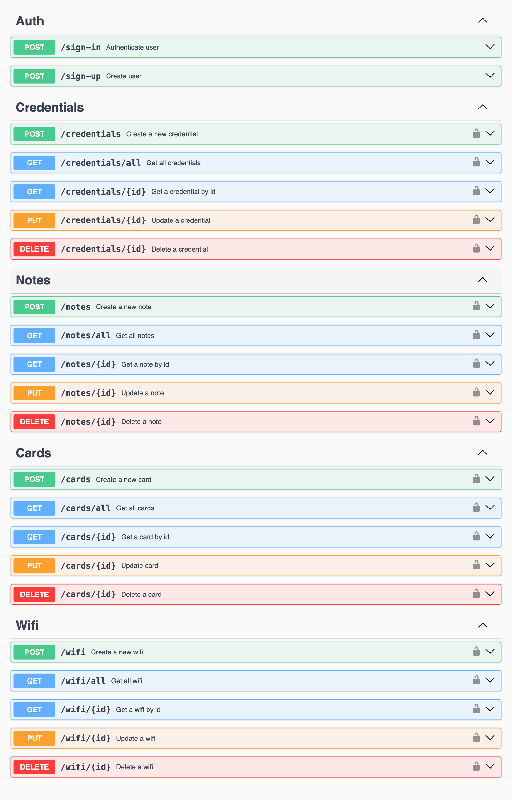

<p align="center"></p>

# <p align="center">DrivenPass</p>

### <p align="center">API para gerenciamento de senhas</p>

<div align="center">
   
   
   
   
   
   
    
    
   
   
   
   
   
</div>

## :clipboard: Descrição

O **DrivenPass** é um gerenciador de senhas que permite armazenar e organizar suas informações sensíveis de forma segura. Com apenas uma senha mestra, você pode guardar múltiplas credenciais, notas, cartões e senhas de Wi-Fi sem precisar memorizá-las. A aplicação foi desenvolvida pensando na crescente necessidade de proteção contra golpes virtuais, oferecendo um local seguro para armazenar senhas longas e complexas que são essenciais para sua segurança online.

## :bookmark_tabs: **Características do Projeto**

**🔐 Autenticação**: Sistema de autenticação via JWT para proteção de rotas
**🔑 Gestão de Credenciais**: Criação, visualização, atualização e exclusão de credenciais
**📝 Gestão de Notas**: Criação, visualização, atualização e exclusão de notas
**💳 Gestão de Cartões**: Criação, visualização, atualização e exclusão de cartões
**🌐 Gestão de Senhas de Wi-Fi**: Criação, visualização, atualização e exclusão de senhas de Wi-Fi
**🛡️ Segurança**: Criptografia de todas as senhas, códigos de segurança (CVV) e demais dados sensíveis.
**📱 Interface**: Documentação completa via Swagger UI
**🧪 Testes**: Cobertura completa com testes unitários e integração

## :rocket: Inicializando este projeto

Primeiro de tudo, clone este projeto ou faça o download do ZIP.

Para realizar o clone, no terminal de sua máquina, utilize o [git](https://git-scm.com/) e insira o seguinte comando:

```bash
   git clone https://github.com/GabrielaTiago/DrivenPass.git
```

Entre na pasta do projeto:

```bash
    cd DrivenPass
```

Crie o arquivo de variáveis de ambiente `.env` na raíz do projeto, copiando o arquivo de exemplo:

```bash
    cp .env.example .env
```

O arquivo `.env` já contém as variáveis necessárias para o funcionamento da aplicação. Você precisará editá-lo dependendo se for rodar o projeto localmente ou com Docker.

:warning: Há dois modos de rodar a aplicação: localmente ou utilizando o Docker.

- **Localmente**: você precisará ter o Node.js e o PostgreSQL instalados na sua máquina.
- **Com Docker**: você não precisa instalar nada além do Docker, pois tudo será gerenciado por contêineres.

## :computer: Rodando a Aplicação Localmente

Para executar esse projeto localmente é necessário que você possua o [Node.js](https://nodejs.org/en/download) (v18+) e [npm](https://www.npmjs.com/) instalados em sua máquina. Você também precisará do [PostgreSQL](https://www.postgresql.org/download/).

No arquivo `.env`, modifique as variáveis de ambiente para corresponder às suas configurações locais do PostgreSQL:

```env
    POSTGRES_USER=seu_usuario       # geralmente é postgres
    POSTGRES_PASSWORD=sua_senha
    POSTGRES_HOST=localhost         # para rodar localmente
```

Para alterar as variáveis de ambiente, execute:

```bash
    # Este comando não funciona no Windows, atualize manualmente
    sed -i '' "s/^POSTGRES_USER=.*/POSTGRES_USER=seu_usuario/" .env
    sed -i '' "s/^POSTGRES_PASSWORD=.*/POSTGRES_PASSWORD=sua_senha/" .env
    sed -i '' "s/^POSTGRES_HOST=.*/POSTGRES_HOST=localhost/" .env
```

Execute o seguinte comando para instalar as dependências do projeto.

```bash
    npm install
```

### :floppy_disk: Configurando o Banco de Dados

Para inicializar e criar o banco de dados com Prisma, execute:

```bash
    # Gerar o cliente Prisma
    npx prisma generate

    # Executar as migrações do banco de dados
    npx prisma migrate dev

    # (Opcional) Para visualizar o banco de dados no Prisma Studio
    npx prisma studio
```

### :arrow_forward: Iniciando a Aplicação

Para iniciar o servidor em modo de desenvolvimento (com hot-reload), execute:

```bash
    npm run dev
```

Para iniciar o servidor em modo de produção, primeiro compile o projeto e depois execute:

```bash
    npm run build
    npm start
```

## 🐳 Rodando a Aplicação com Docker

Para rodar a aplicação utilizando o Docker, você precisa ter o [Docker](https://docs.docker.com/engine/install/) e [Docker Compose](https://docs.docker.com/compose/install/) instalados.

No arquivo `.env`, garanta que a variável `POSTGRES_HOST` corresponda ao nome do serviço do banco no `docker-compose.yml`:

```env
    POSTGRES_HOST=drivenpass-db
    POSTGRES_DB=drivenpass
```

Execute o seguinte comando para construir as imagens e iniciar os contêineres da API e do banco de dados:

```bash
    npm run docker:dev
```

_(O banco de dados será criado e populado automaticamente na primeira vez que você executar este comando)._

Para parar e remover os contêineres, execute:

```bash
    npm run docker:down
```

Para remover os containers, volumes e imagens criadas, realizando assim o resete completo, execute:

```bash
    npm run docker:destroy
```

## :world_map: Rotas

A aplicação estará disponível em `http://localhost:4000` (ou a porta que você definir no `.env`).

A documentação da API, implementada com **Swagger**, pode ser acessada na rota: [**/documentation**](http://localhost:4000/documentation)



## :test_tube: Testes

O projeto é configurado com dois tipos de testes:

**Testes Rápidos (Unitários e Integração):** Verificam a lógica de negócio de forma isolada e rápida.

```bash
    npm test
```

Para rodar os testes dentro de um ambiente Docker controlado, execute:

```bash
    npm run docker:test
```

Para visualizar os testes, execute:

```bash
    npm run test:ui
```

## :bulb: Reconhecimentos

- [Badges para Github](https://github.com/alexandresanlim/Badges4-README.md-Profile#-database-)
- [Inspiração de README](https://gist.github.com/luanalessa/7f98467a5ed62d00dcbde67d4556a1e4#file-readme-md)
- [Driven Education](https://www.driven.com.br)

## 👩🏽‍💻 Autora

Gabriela Tiago de Araújo

- email: <gabrielatiagodearaujo@outlook.com>
- linkedin: <https://www.linkedin.com/in/gabrielatiago/>
- portfolio: <https://gabrielatiago.vercel.app>

[🔝 Voltar ao topo](#drivenpass)
